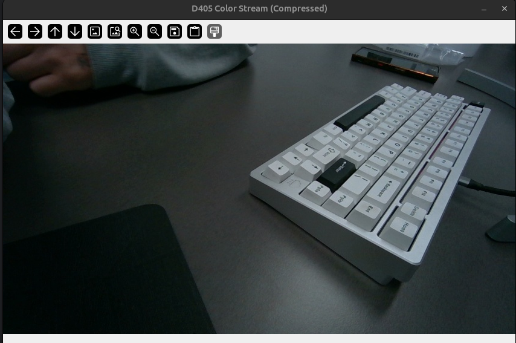

# RealSense D405 Publisher

<br>

## 종속성 설치
```shell
pip install -r requirements.txt
```

<br>

## 실행
```shell
# Run Publisher
python3 scripts/d405_node.py config/d405.config.yaml

# Run Viewer
python3 scripts/d405_viewer.py
```

<br>




## Conda python3.12 (dsr) 생성

## lerobot 설치후 'brotli' 모듈 충돌 문제 발생시
pip uninstall -y brotli brotlicpy huggingface_hub datasets
pip install --upgrade brotli huggingface_hub datasets