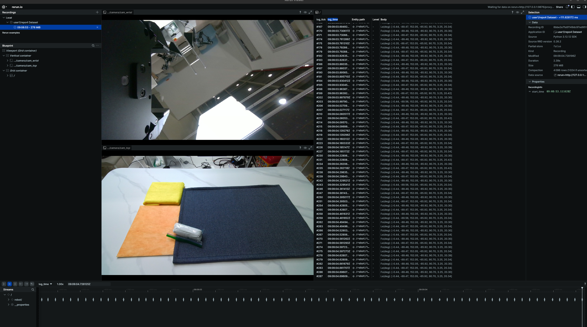

# Lerobot Dataset 생성 및 추론 모듈
로보티즈 의존성을 제거하고 Lerobot 데이터셋을 구축 및 모델 테스트를 하기 위한 프로젝트



<br>

## 기능
### 데이터 토픽 및 Omy_f3m 제어
- 데이터 수집 과정에서 필요한 **데이터 토픽** 관리 및 **omy_f3m** 장치 제어와 관련된 기능은 `communicator.py` 파일에 구현되어 있습니다.

  <br>

## 환경 셋업

```shell
# conda 환경 생성
$ conda create --name lerobot python=3.12
$ conda activate lerobot

# 라이브러리 설치
$ pip install -r requirements.txt
```
<br>


## 버전
- lerobot: 0.4.3

<br>

## 학습 명령어
- ~/.cache/huggingface/lerobot에서 아래 명령어 실행
```shell
$ cd ~/.cache/huggingface/lerobot

$ lerobot-train \
--dataset.repo_id=user1/repo1 \           # 학습할 데이터셋 
--policy.type=act \                       # 모델
--output_dir=outputs/train_user1_repo1 \  # 학습 결과 저장 경로
--batch_size=1 \
--steps=100000 \
--policy.push_to_hub false
```
<br>


## 데이터셋 v2.1 -> v3.0 변환
- 기존 데이터셋은 old 레포지토리로 자동으로 이동됩니다

```shell
$ python /home/uon/miniconda3/envs/lerobot-collection/lib/python3.12/site-packages/lerobot/datasets/v30/convert_dataset_v21_to_v30.py \
--repo-id user1/repo1 \ # 변환할 데이터셋
--push-to-hub false
```
<br>


## 단축키
| 단축키 | 기능 | 설명 |
| :---: | :--- | :--- |
| **Page Down** | 에피소드 녹화/저장 | 현재 진행 중인 에피소드를 녹화하고 저장합니다. |
| **Delete** | 녹화 중인 에피소드 취소 | 현재 녹화 중인 에피소드를 저장하지 않고 취소합니다. |
| **End** | 데이터셋 Finalize | 모든 녹화가 완료된 후, 데이터셋을 최종적으로 확정(Finalize)합니다. |

<br>

## 데이터 수집
> **주의:** 아래의 HF_REPO_ID를 수정해서 데이터셋이 저장되는 경로를 설정하세요.\
> 기존에 수집한 데이터셋이 삭제될 수 있습니다.
```python
# ==============================
# 전역 변수
# ==============================
ROOT_PATH = Path.home() / '.cache/huggingface/lerobot'
HF_REPO_ID = "user1/repo4"                      # Repo_io (Dir)
TASK_DESCRIPTION = "pick up the zipper bag"     # Task Instruction
FPS = 30                                        # FPS
```

```shell
$ python main_dataset.py
```

<br>

## Inference
> **주의:** Inference를 실행하기 전에 omy_f3m 제어 설정이 스무딩으로 되었는지 꼭 확인하세요.\
> 엔코더가 망가질 수 있습니다.
```python
MODEL_PATH = DEFAULT_SAVE_ROOT_PATH / "outputs/train_user1_repo1/checkpoints/last/pretrained_model/" # 학습된 모델 경로
DATASET_PATH = DEFAULT_SAVE_ROOT_PATH / "user1/repo1"                                                # 데이터셋 경로

...

# 로봇 동작
joint = action.squeeze().tolist()
# communicator.action_publish(joint) # 로봇을 제어 하려면 이 부분을 주석 해제하세요.
```
```shell
$ python main_inference.py
```