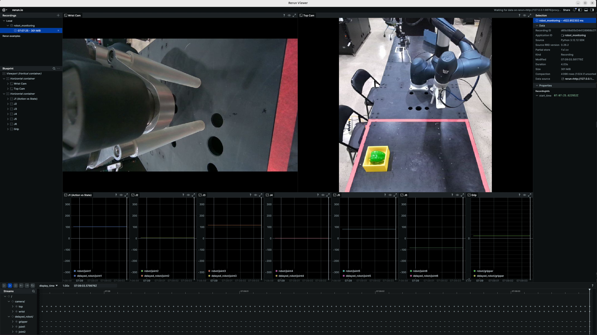

# Lerobot Doosan Robot
두산 로봇, 3지 그리퍼, 실시간 제어, 데이터 수집, 학습, 추론

- 리얼센스 카메라
- 키넥트 카메라
- 두산 로봇 리더암 제어
- 실시간 제어
- lerobot 데이터 수집 및 학습
- 추론

### 환경 설치

> [!NOTE]
> conda 환경을 추천합니다.

```shell
pip install -r requirements.txt
```

## 실행 방법

### 데이터 수집

> [!IMPORTANT]
> 로보티즈 리더암을 킨 후에 Idle 자세로 옮기지 않으면 두산 로봇이 켜지면서 충돌 할 수 있습니다.

```shell
# 리얼센스 카메라 on
python ./scripts/camera_d405_node.py

# 키넥트 카메라 on
python ./scripts/camera_kinect_node.py

# 로보티즈 리더암 on (키고나서 리더암 자세는 미리 idle 포즈로 옮겨주세요)
ros2 launch open_manipulator_bringup omy_l100_leader_ai.launch.py 

# 두산 로봇 팔로워 on (로보티즈 리더암을 먼저 키고난 후에 실행하세요)
python ./scripts/dsr_node.py

# 데이터 수집
python main_dataset_joint.py
```

#### 단축키
- `page down`: 녹화 시작
- `delete`: 녹화중인 에피소드 제거
- `end`: 데이터 수집 종료

### 인퍼런스

> [!IMPORTANT]
> 인퍼런스 할때는 로보티즈 리더암을 꺼주세요.

```shell
# 리얼센스 카메라 on
python ./scripts/camera_d405_node.py

# 키넥트 카메라 on
python ./scripts/camera_kinect_node.py

# 두산 로봇 인퍼런스용 스크립트 실행
python ./scripts/dsr_infer_node.py

# 인퍼런스 실행
python main_infer_joint.py
```

## 전역 변수 설정

### 데이터 수집

> [!NOTE]
> 저장 디렉토리는 `/home/uon/.cache/huggingface/lerobot`에 `user2/dsr3`으로 생깁니다.

> [!TIP]
> config/comm.config.yaml에서 받고자 하는 토픽을 추가할 수 있습니다.

#### main_dataset_joint.py
```python
HF_REPO_ID          = "user2/dsr3"      # Repo_io (Dir)
IS_RECORDING        = False
START_TIME          = 0
TASK_DESCRIPTION    = "pick up the object"
STATUS              = 'ready'
TIMER               = PrecisionTimer(30) # 30hz

# ...

# 데이터 형식에 맞게 수정하세요
FEATURES = {

    'observation.images.cam_top': {
        'dtype': 'video',
        'shape': (720, 630, 3),
        'names': ['height', 'width', 'channels']
    },
    'observation.images.cam_wrist': {
        'dtype': 'video',
        'shape': (480, 848, 3),
        'names': ['height', 'width', 'channels']
    },
    'observation.state': {
        'dtype': 'float32',
        'shape': (7,),
        'names': FULL_ORDER
    },
    'action': {
        'dtype': 'float32',
        'shape': (7,),
        'names': FULL_ORDER
    },
}

# ..

# 데이터 컨버터 필요한 경우 구현해서 사용
img_top           = convert_compressedImage_to_numpy(msgs['cam_top'])
img_wrist         = convert_compressedImage_to_numpy(msgs['cam_wrist'])
joint_follower    = convert_jointState_to_numpy_list(msgs['follower'], JOINT_ORDER)
gripper_val       = msgs['gripper'].data

# ...

# 데이터 형식에 맞게 수정하세요
frame_data = {
    'observation.images.cam_top'    : img_top,
    'observation.images.cam_wrist'  : img_wrist,
    'observation.state'             : delayed_state,
    'action'                        : full_data,
    'task'                          : TASK_DESCRIPTION,
}
```

### 인퍼런스

#### main_infer_joint.py
```python
# 인퍼러스할 데이터셋과 학습 모델 경로를 설정하세요.
DEFAULT_SAVE_ROOT_PATH = Path.home() / '.cache/huggingface/lerobot'
TIMER                  = PrecisionTimer(30) # 30hz
MODEL_PATH             = ('/nas/MIN_JU_SIK/dataset/user2/dsr1_train/checkpoints/180000/pretrained_model') # local
DATASET_PATH           = '/nas/MIN_JU_SIK/dataset/user2/dsr1' # local
TASK_DESCRIPTION       = "pick up the objec"
ROBOT_TYPE             = "omy_f3m"

# ...

# --- 데이터 변환 ---
img_top           = convert_compressedImage_to_numpy(msgs['cam_top'])               # cam top
img_wrist         = convert_compressedImage_to_numpy(msgs['cam_wrist'])             # cam wrist
joint_follower    = convert_jointState_to_numpy_list(msgs['follower'], JOINT_ORDER) # 조인트
gripper_val       = msgs['gripper'].data                                            # 그리퍼

# ...

# --- 입력 데이터 구성 ---
obs = {
    'cam_top'   : img_top,
    "cam_wrist" : img_wrist,
    'joint1'    : joint_follower[0],
    'joint2'    : joint_follower[1],
    'joint3'    : joint_follower[2],
    'joint4'    : joint_follower[3],
    'joint5'    : joint_follower[4],
    'joint6'    : joint_follower[5],
    'gripper': gripper_val,
}

```


## 학습 명령어
```shell
lerobot-train \
  --policy.type=act \
  --dataset.repo_id=/nas/MIN_JU_SIK/dataset/user2/dsr2 \
  --output_dir=/nas/MIN_JU_SIK/dataset/user2/dsr2_train \
  --steps=300000 \
  --batch_size=32 \
  --policy.push_to_hub false
```



##### 데이터 수집
https://github.com/user-attachments/assets/45b7ed9d-0bd1-4df0-afc1-7fce5a728928

##### 인퍼런스


https://github.com/user-attachments/assets/b4c01705-11a2-44f0-80ce-e4daf22f80f3


