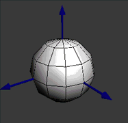
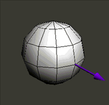
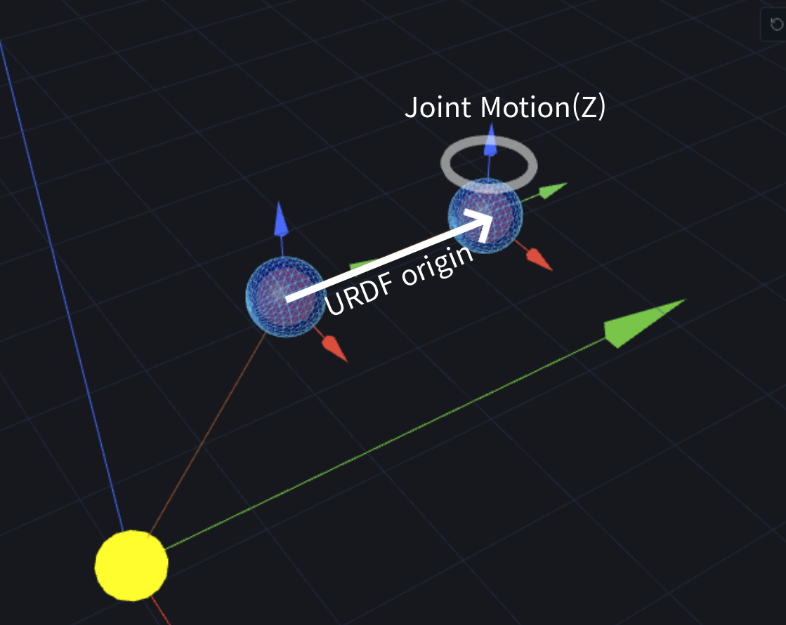

# IK Solver Algorithm

본 문서는 `IkSolver`에 구현된 기네마틱스 및 역기네마틱스(IK) 알고리즘을 설명합니다.

---

## 1. 개요

이 솔버는 수치적(Numerical) 방식을 기반으로 하며, **Damped Least Squares (DLS)** 를 **Quadratic Programming (QP)** 형식으로 정형화하여 제약 조건(Joint Limit, Workspace Limit)을 동시에 해결합니다.

## 2. Transform의 기초

### 행렬 정의
로봇 공학에서 위치와 자세를 동시에 표현하기 위해 **4x4 동차 변환 행렬 (Homogeneous Transformation Matrix)** 을 사용합니다.

$$
T =
\begin{bmatrix}
R & p \\
0 & 1
\end{bmatrix}
=\
\begin{bmatrix}
r_{11} & r_{12} & r_{13} & p_x \\
r_{21} & r_{22} & r_{23} & p_y \\
r_{31} & r_{32} & r_{33} & p_z \\
0 & 0 & 0 & 1
\end{bmatrix}
$$

* $R$: 회전 행렬 (Rotation Matrix)
* $p$: 위치 벡터 (Translation Vector)

### Transform 생성
[`Kinematics::make_tf`](include/transform.hpp#L117) 함수는 위치($x, y, z$)와 오일러 각($roll, pitch, yaw$)을 입력받아 하나의 동차 변환 행렬($H$)을 생성합니다. 로봇 베이스를 기준으로 한 **Extrinsic ZYX (또는 Intrinsic XYZ) 오일러 각** 순서를 따릅니다.

$$
H = T(x, y, z) \cdot R_x(roll) \cdot R_y(pitch) \cdot R_z(yaw)
$$

*   **회전 순서**: Fixed(Base) 프레임 기준으로는 $Z \to Y \to X$ 순서의 회전과 같으며, 회전 행렬의 곱은 $R = R_x \cdot R_y \cdot R_z$ 순서로 이루어집니다. 이 방식은 사용자가 슬라이더를 조절할 때 베이스 좌표계 축을 기준으로 회전하는 직관적인 느낌을 줍니다.
*   **성분 구성**:
    - $T(x,y,z)$: 좌표계의 평행 이동
    - $R_x(roll)$: $X$축 기준 회전 (Roll)
    - $R_y(pitch)$: $Y$축 기준 회전 (Pitch)
    - $R_z(yaw)$: $Z$축 기준 회전 (Yaw)

### 오차(Twist) 계산
두 자세 사이의 차이를 수치적으로 계산하기 위해 **Twist** (또는 6D 오차 벡터) 개념을 사용합니다. 이는 현재 상태에서 목표 상태로 가기 위한 **미소 이동 및 회전 속도량**을 의미하며, `Transform::twist` 함수에 구현되어 있습니다.

$$
\Delta x =
\begin{bmatrix}
e_p \\
\omega
\end{bmatrix}_{6 \times 1}
$$

* **위치 오차 ($e_p$):** 목표 위치와 현재 위치의 단순 차이입니다 ($e_p = p_{tar} - p_{cur}$).
* **회전 오차 ($\omega$):** 상대 회전 행렬을 회전 벡터(Axis-Angle)로 변환한 값으로, 자코비안 연산에서 **각속도(Angular Velocity)** 성분으로 취급됩니다.

#### 회전 오차(각속도) 계산

로봇 엔드-이펙터의 현재 자세를 $R_{cur}$, 목표 자세를 $R_{tar}$이라고 할 때, **상대 회전 행렬** $R_{rel}$은 다음과 같습니다.

$$
R_{rel} = R_{cur}^T R_{tar}
$$

이 $R_{rel}$에 **Logarithmic Map**을 적용하여 로컬 회전 벡터 $\omega_{local}$을 구합니다.

$$
\omega_{local} = \text{Log}(R_{rel}) = \hat{k} \theta
$$

1.  **회전각 ($\theta$):** $\theta = \cos^{-1}\left(\frac{\text{Tr}(R_{rel}) - 1}{2}\right)$
2.  **회전축 ($\hat{k}$):** $\hat{k} = \frac{1}{2\sin\theta} \begin{bmatrix} r_{32} - r_{23} \\ r_{13} - r_{31} \\ r_{21} - r_{12} \end{bmatrix}$

이 오차는 현재 로컬 프레임 기준이므로, 자코비안이 정의된 **전역 좌표계(Base Frame)** 로 투영하여 최종적인 회전 오차 $\omega$를 구합니다.

$$
\omega_{3\times 1} = R_{cur_{3 \times 3}} \cdot \omega_{local_{3 \times 1}}
$$

따라서 최종적인 회전 오차 $e_R$는 $3 \times 1$ 크기의 **회전 벡터** 형태로 산출되며, 이는 자코비안의 회전 성분과 직접 매칭되어 미분 키네마틱스 연산에 사용됩니다.

이 방식은 오일러 각 사용 시 발생하는 **짐벌 락(Gimbal Lock)** 문제를 피할 수 있으며, 두 자세 사이의 최단 경로를 따라 오차를 계산합니다.

|  |  |
|:-------------------------------------------------:|:-------------------------------------------------:|
|                Euler Rotation(ZYX)                |                    Axis Angle                     |

---

## 3. Forward Kinematics (FK)

FK는 각 관절의 각도($q$)가 주어졌을 때, 로봇 베이스를 기준으로 엔드 이펙터(TCP)의 위치와 자세를 구하는 과정입니다. 이는 관절 간의 변환 행렬($H$)을 연속적으로 곱하는 **Transform Chaining**으로 표현됩니다.

$$
H_{Base}^{TCP} = H_1(q_1) \cdot H_2(q_2) \cdot H_3(q_3) \cdot H_4(q_4) \cdot H_5(q_5) \cdot H_6(q_6) \cdot H_{Tool}
$$

각 관절의 변환 행렬 $H_i(q_i)$는 URDF 구조에 따라 **고정 오프셋**과 **관절의 움직임**이 결합되어 계산됩니다.

$$
H_i(q_i) = \underbrace{T_{offset, i}}_{\text{URDF Origin}} \cdot \underbrace{R_i(q_i)}_{\text{Joint Motion}}
$$

*   **$H_i(q_i)$**: $(i-1)$번 링크 프레임에서 $i$번 링크 프레임까지의 변환 행렬
*   **$T_{offset, i}$**: 부모 링크에서 조인트 원점까지의 고정된 변환 (고정된 위치/자세)
*   **$R_i(q_i)$**: 조인트 값 $q_i$에 의해 발생하는 상대적인 회전 또는 이동
*   **$H_{Tool}$**: 로봇의 마지막 플랜지(Flange)에서 실제 도구 끝(TCP)까지의 도구 오프셋 (End-Effector offset)

|  |
|:-------------------------------------------------:|
|                  $$ H_i(q_i) $$                   |

# 4. Inverse Kinematics (IK)

IK는 원하는 엔드 이펙터의 위치와 자세($T_{target}$)가 주어졌을 때, 이를 만족하는 관절 각도($q$)를 찾는 과정입니다. 

### Jacobian Matrix (자코비안 행렬) 정의

자코비안 행렬은 로봇의 관절 공간(Joint Space)에서의 속도($\dot{q}$)와 작업 공간(Task Space)에서의 엔드 이펙터 속도($\dot{x}$) 사이의 관계를 나타내는 행렬입니다. 이는 로봇의 미분 운동학(Differential Kinematics)을 설명하며, 역기구학(IK) 문제 해결에 핵심적인 역할을 합니다.

엔드 이펙터의 위치와 자세를 나타내는 작업 공간 벡터 $x \in \mathbb{R}^m$와 로봇의 관절 각도 벡터 $q \in \mathbb{R}^n$ 사이의 관계는 다음과 같이 표현됩니다.
$$
\dot{x} = J(q) \dot{q}
$$

여기서 $J(q)$는 $m \times n$ 크기의 자코비안 행렬이며, 각 요소는 작업 공간 변수의 각 관절 변수에 대한 편미분으로 구성됩니다.

$$
J(q) = \begin{bmatrix}
\frac{\partial p_x}{\partial q_1} & \frac{\partial p_x}{\partial q_2} & \frac{\partial p_x}{\partial q_3} & \frac{\partial p_x}{\partial q_4} & \frac{\partial p_x}{\partial q_5} & \frac{\partial p_x}{\partial q_6} \\
\frac{\partial p_y}{\partial q_1} & \frac{\partial p_y}{\partial q_2} & \frac{\partial p_y}{\partial q_3} & \frac{\partial p_y}{\partial q_4} & \frac{\partial p_y}{\partial q_5} & \frac{\partial p_y}{\partial q_6} \\
\frac{\partial p_z}{\partial q_1} & \frac{\partial p_z}{\partial q_2} & \frac{\partial p_z}{\partial q_3} & \frac{\partial p_z}{\partial q_4} & \frac{\partial p_z}{\partial q_5} & \frac{\partial p_z}{\partial q_6} \\
\frac{\partial \omega_x}{\partial q_1} & \frac{\partial \omega_x}{\partial q_2} & \frac{\partial \omega_x}{\partial q_3} & \frac{\partial \omega_x}{\partial q_4} & \frac{\partial \omega_x}{\partial q_5} & \frac{\partial \omega_x}{\partial q_6} \\
\frac{\partial \omega_y}{\partial q_1} & \frac{\partial \omega_y}{\partial q_2} & \frac{\partial \omega_y}{\partial q_3} & \frac{\partial \omega_y}{\partial q_4} & \frac{\partial \omega_y}{\partial q_5} & \frac{\partial \omega_y}{\partial q_6} \\
\frac{\partial \omega_z}{\partial q_1} & \frac{\partial \omega_z}{\partial q_2} & \frac{\partial \omega_z}{\partial q_3} & \frac{\partial \omega_z}{\partial q_4} & \frac{\partial \omega_z}{\partial q_5} & \frac{\partial \omega_z}{\partial q_6}
\end{bmatrix}_{m \times n}
$$

일반적으로 6자유도 로봇의 경우, 엔드 이펙터의 위치($p_x, p_y, p_z$)와 자세($\omega_x, \omega_y, \omega_z$)를 모두 고려하므로 $m=6$이 됩니다. 따라서 자코비안 행렬은 다음과 같이 선형 속도 성분과 각속도 성분으로 나눌 수 있습니다.

$$
J(q) = \begin{bmatrix}
J_P \\
J_O
\end{bmatrix}_{6 \times 6}
$$

### Symbolic Method (심볼릭 연산)

자코비안을 구하는 근본적인 방법은 로봇의 순기구학(FK) 함수를 각 관절 각도에 대해 **미분**하는 것입니다.

#### 1. 간단한 미분 방법 (Differentiation)

함수 $f(q)$가 주어졌을 때, 입력 $q$의 미세한 변화 $dq$가 출력 $f$에 미치는 영향(기울기)은 다음과 같이 정의됩니다.

$$ \frac{df}{dq} = \lim_{\Delta q \to 0} \frac{f(q + \Delta q) - f(q)}{\Delta q} $$

로봇 공학에서는 여러 개의 입력(Joint)과 여러 개의 출력(Pose)이 존재하므로, 각 관절에 대해 개별적으로 미분하는 **편미분(Partial Derivative)**을 수행합니다. 예를 들어, 두 번째 관절 $q_2$가 변할 때의 출력 변화는 $\frac{\partial f}{\partial q_2}$로 표현합니다.

#### 2. 미분을 이용한 자코비안 생성

자코비안 행렬 $J$는 순기구학 방정식 $x = f(q)$의 모든 출력 성분을 모든 입력 성분(관절)에 대해 편미분하여 행렬 형태로 나열한 것입니다.

$$
J = \frac{\partial f}{\partial q} = 
\begin{bmatrix}
\frac{\partial f_1}{\partial q_1} & \frac{\partial f_1}{\partial q_2} & \cdots & \frac{\partial f_1}{\partial q_n} \\
\frac{\partial f_2}{\partial q_1} & \frac{\partial f_2}{\partial q_2} & \cdots & \frac{\partial f_2}{\partial q_n} \\
\vdots & \vdots & \ddots & \vdots \\
\frac{\partial f_m}{\partial q_1} & \frac{\partial f_m}{\partial q_2} & \cdots & \frac{\partial f_m}{\partial q_n}
\end{bmatrix}
$$

*   **행(Row)**: 엔드 이펙터의 속도 성분 ($v_x, v_y, v_z, \omega_x, \omega_y, \omega_z$)
*   **열(Column)**: 각 관절($q_1, q_2, \dots, q_n$)의 기여도

#### 3. 구현 방식: 해석적 vs 자동 미분

1.  **해석적 방식 (Analytic)**: 사람이 직접 손으로 미분 수식을 유도하여 코드로 옮깁니다. 정확도가 매우 높지만, 로봇의 구조가 복잡해지면 수식을 도출하기 어렵습니다.
2.  **자동 미분 (Automatic Differentiation)**: 본 솔버가 지원하는 방식 중 하나로, `fk_kernel`과 같은 수식 코드를 실행함과 동시에 컴퓨터가 **Chain Rule**을 적용하여 미분값을 자동으로 계산합니다. 수치 미분(Numerical)의 오차 문제와 해석적 미분의 복잡성 문제를 동시에 해결합니다.

### Geometric Interpretation (기하학적 해석)

자코비안 행렬의 각 열(Column) $j_i$는 $j$번째 관절의 속도 $\dot{q}_i$가 엔드 이펙터의 선속도 $v$와 각속도 $\omega$에 미치는 기하학적 기여도를 나타냅니다.

$$
j_i = \begin{bmatrix}
j_{P,i} \\
j_{O,i}
\end{bmatrix}
$$

관절의 타입(Revolute 또는 Prismatic)에 따라 기하학적으로 다음과 같이 정의됩니다.

#### 1. 회전 관절 (Revolute Joint)
회전 관절 $i$가 회전할 때, 엔드 이펙터는 해당 관절의 회전축을 중심으로 원운동을 합니다.

*   **선속도 성분 ($j_{P,i}$):** 관절의 회전축 $z_i$와 '관절 위치($p_i$)에서 엔드 이펙터 위치($p_{ee}$)까지의 벡터'의 외적(Cross Product)으로 결정됩니다.
    $$ j_{P,i} = z_i \times (p_{ee} - p_i) $$
*   **각속도 성분 ($j_{O,i}$):** 관절의 회전축 방향이 곧 엔드 이펙터의 각속도 방향이 됩니다.
    $$ j_{O,i} = z_i $$

#### 2. 병진 관절 (Prismatic Joint)
병진 관절 $i$가 움직일 때, 엔드 이펙터는 관절의 이동축 방향을 따라 직선 운동을 합니다.

*   **선속도 성분 ($j_{P,i}$):** 관절의 이동축 방향이 곧 엔드 이펙터의 선속도 방향입니다.
    $$ j_{P,i} = z_i $$
*   **각속도 성분 ($j_{O,i}$):** 병진 운동은 엔드 이펙터의 방향(Orientation)을 변화시키지 않으므로 0입니다.
    $$ j_{O,i} = 0 $$

---
