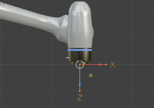
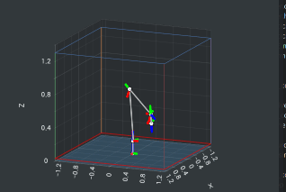

# IK Solver (Inverse Kinematics Solver)

실시간 로봇 제어를 위한 C++ 기반 역기구학(Inverse Kinematics) 라이브러리입니다.
특이점(Singularity) 모션에서 관절 속도가 무한대로 발산하는 문제를 이차 계획법(QP) 기반의 최적화를 통해 안정적으로 제한하며, 다양한 제약 조건(Joint Limit, Velocity Limit, Workspace Limit)을 실시간으로 계산합니다.

<br>

## 주요 특징
|특징| 설명                                                                   |
|:-------:|----------------------------------------------------------------------|
|특이점 안정성| Levenberg-Marquardt 기반 Damping을 적용해 특이점 통과 시에도 관절 속도가 무한대로 발산하지 않습니다. |
|제약 조건 최적화| QP Solver가 Joint limit, Velocity limit, Workspace limit을 매 루프마다 체크합니다.|
|End-Effector 설정| End-Effector가 설정되면 자동으로 계산에 적용됩니다.                                   |
|URDF 지원| 로봇의 URDF 파일을 읽어 자동으로 Kinematics 체인을 구성합니다. (URDF가 없는 경우 직접 구성 가능)    |
|고속 연산| Eigen 기반 최적화로 1kHz 이상의 제어 루프에서 안정적으로 동작합니다.                          |
|Python 바인딩| `pybind11`을 통한 Python 인터페이스를 제공하여 간편한 테스트가 가능합니다.                    |

> **ℹ️ 정보:** Trajectory 기능은 없습니다.

<br>

## 종속성 및 설치
| Eigen3  |  선형 대수 연산 라이브러리  |                                                                                                                              |
|:-------:|:----------------:|------------------------------------------------------------------------------------------------------------------------------|
| urdfdom | URDF 파일 파싱 라이브러리 | `sudo apt install liburdfdom-dev`                                                                                            |
|  ImGui  |    시각화 라이브러리     | `git submodule update --init --recursive` |

<br>

## 프로젝트에 라이브러리 추가
> **ℹ️ 정보:** 라이브러리로 사용하려면 아래의 방법을 따라주세요.

#### 프로젝트 구조 예시
````
Project_Root/
├── build / 
├── CMakeLists.txt # <- 여기에 위에 cmake 코드를 작성 합니다.
├── ik_solver /    # <- ik solver 리포지토리 
├── include /
└── src /
````

#### 라이브러리 다운로드
```shell
# ik solver 리포지토리 다운로드
git clone https://github.com/uonrobotics/ik_solver.git ik_solver
```

#### CMakeLists.txt 추가
```cmake
# ik_solver 하위 디렉토리 추가
add_subdirectory(ik_solver)

# 라이브러리 링크
target_link_libraries(${YOUR_PROJECT_NAME} PRIVATE iksolver)
```

#### 라이브러리 사용
```c++
#include "ik_solver.h"

int main () {
    IkSolver solver = IkSolver("robot.urdf");
    if (!solver.init())
        return -1;
    
    return 0;
}
```


<br>

## 예제 실행
> **ℹ️ 정보:** 예제 파일은 이 레포지토리가 main으로 빌드된 경우에만 생성됩니다. \
> `add_subdirectory(ik_solver)`를 사용한 경우 예제 파일은 생성되지 않습니다.

> example_main은 `content` 디렉토리에 있는 블렌더 파일로 시각화가 가능합니다.

#### 예제 활성화 방법
[CMakeLists.txt](CMakeLists.txt#L66)를 확인하세요.

#### 빌드 및 실행

```shell
# 빌드
mkdir build && cd build
cmake ..
make

# 실행
./example_main
```

<br>

## Python 바인딩
> **⚠️ 주의:** 파이썬 바인딩의 경우 시스템(프로젝트)에서 사용하는 파이썬 버전에 맞게 .so 파일을 생성해야 합니다.
* 파이썬 바인딩을 원하는 경우 [CMakeLists.txt](CMakeLists.txt#78)의 78번째 줄을 주석 해제 하세요.
* 사용하고 싶은 cpp 함수는 [pybind_module.cpp](python/pybind_module.cpp)를 수정하세요. 파이썬 바인딩이 추가됩니다.

#### 빌드
```shell
mkdir build && cd build
cmake ..
make ik_solver_py -j # python 디렉토리에 ik_solver_py.cpython-312-x86_64-linux-gnu.so가 생성되어야 함
```

#### 실행
> **⚠️ 주의:**  `ik_solver_py.cpython-312-x86_64-linux-gnu.so` 파일은 반드시 `ik_solver.py` 와 같은 디렉토리에 위치 시켜 주세요. [참고](python/ik_solver.py#L9)
```shell
python3 python/example_main.py
```


<br>

## 주요 기능 가이드

### 1. URDF를 통한 초기화

> **⚠️ 주의**: 공식 URDF 파일은 실제 하드웨어의 한계점보다 큰 값이 설정되어 있을 수 있습니다.
> 실제 로봇 사양에 맞춰 수정하거나 코드에서 별도로 설정하는 것을 권장합니다.

- Solver 생성시 urdf 파일을 입력으로 Kinematics를 구성합니다.
- urdf 파일이 없을 경우 **[`Kinematics::make`](src/kinematics.cpp#L187)** 함수를 사용해 직접 Kinematics를 구성 할 수 있습니다.

```c++
IkSolver solver = IkSolver("robot.urdf");
if (!solver.init()) {
    std::cout << "Solver 초기화 실패" << std::endl;
}
```

### 2. 제약 조건 설정 (Constraints)

각 관절 및 TCP의 동작 범위를 제한하는 설정입니다.

#### 관절 각도 제한 (Joint Limit)

```c++
solver.set_joint_limit(joint_index, min, max); // [rad]
```


| Joint3 (-160deg ~ 160deg)                       | Joint3 (1deg ~ 160deg)                          |
|-------------------------------------------------|-------------------------------------------------|
|  |  |

#### 관절 속도 제한 (Joint Velocity Limit)

```c++
solver.set_joint_vlimit(joint_index, velocity); // [rad/s]
solver.set_safety_scale(1.2); // 1.0 ~ 2.0 (클수록 속도 억제)
```

#### TCP 속도 제한 (TCP Speed Limit)

> **⚠️ 주의**:  speed를 **0**으로 설정할 경우 Linear 모션 특성이 사라집니다.   
> **이 기능은 불안정할 수 있습니다.**

```c++
solver.set_tcp_speed_limit(1.0); // 1.0 [m/s]
```


| TCP Speed = 1.0                                 | TCP Speed = 0.0                                 |
| ----------------------------------------------- | ----------------------------------------------- |
|  |  |

#### 작업 공간 제한 (Workspace Limit)

> **⚠️ 주의**: 작업 공간 제한하는 기준은 TCP의 위치를 기준으로 합니다. \
> End-Effector가 설정된 경우 자동으로 TCP가 계산됩니다.

```c++
solver.set_workspace_limitX(-1.3, 1.3); // min, max [m]
solver.set_workspace_limitY(-1.3, 1.3);
solver.set_workspace_limitZ(0.0, 1.3);
```

| Workspace Limit                                 | Move to Limit                                   |
| ----------------------------------------------- | ----------------------------------------------- |
|  |  |

#### 제한 모드 설정(Limit Mode)
> Relax: 경로 이탈 허용 (도달 속도 약간 빠름) \
> Strict: 경로 엄격 유지
```c++
solver->set_relax_mode();  # Relax 모드 
solver->set_strict_mode(); # Strict 모드
```

|  |  |
|:-------------------------------------------------:|:-------------------------------------------------:|
|                    STRICT_PATH                    |                    RELAX_PATH                     |


### 3. 제어 함수

#### [IkSolver::movel](src/ik_solver.cpp#L71)
> **ℹ️ 중요**: movel 함수는 가능한 빠르고 일정하게 호출할 수 있는 타이머(쓰레드)에서 호출해야 합니다.
> 호출 간격이 느려지면 내부에서 계산되는 max_dist가 커지면서 solver가 불안정해질 수 있습니다.

```c++
// movel 호출 예시
#include <iostream>
#include <thread>
#include <chrono>
#include "ik_solver.h"

#define SLEEP(ms) std::this_thread::sleep_for(std::chrono::milliseconds(ms))

int main() {
    // Solver 초기화
    IkSolver solver("robot.urdf");
    if (solver.init() == false) 
        return -1;
    
    // 목표 위치
    Transform target_tf = Transform::make_tf(0.5, 0.0, 0.4, 0, 1.57, 0); // x, y, z, roll, pitch, yaw

    // 실시간 제어 쓰레드 생성
    std::thread control_thread([&]() {
        while (true) {
            auto start_time = std::chrono::steady_clock::now();

            // 현재 위치에서 target_tf를 향해 한 스텝 계산
            solver.movel(target_tf);
            
            // 계산된 관절 각도 획득 및 모터 명령 전달
            auto q = solver.get_curr_joint_rad();

            // 정확한 주기 유지를 위한 대기 (10ms)
           SLEEP(1); // 1ms
        }
    });

    
    // 메인 로직 (UI, 센서 데이터 처리 등)
    while (true) {
        // 예: ui에서 target_tf 값을 바꾸면 실시간으로 joint가 계산됨
        SLEEP(1000); // 1sec
    }

    
    // 종료
    if (control_thread.joinable()) control_thread.join();

    return 0;
}
```

#### [IkSolver::movej](src/ik_solver.cpp#L142)
> 이 Solver에서 movej는 TCP 위치 계산하기 위해 사용할 수 있습니다.
```c++
// movej 호출 예시
#include <iostream>
#include <thread>
#include <chrono>
#include "ik_solver.h"

#define SLEEP(ms) std::this_thread::sleep_for(std::chrono::milliseconds(ms))

int main() {
    // Solver 초기화
    IkSolver solver("robot.urdf");
    if (solver.init() == false) 
        return -1;
    
    // 메인 로직 (UI, 센서 데이터 처리 등)
    while (true) {
        // 예: ui에서 각 조인트 값을 설정 후 tcp의 자세를 출력하기
        float joint[6] = {
            0.0f,       // rad
            0.174533f,  // rad
            0.349066f,  // rad
            0.523599f,  // rad
            0.698132f,  // rad
            0.872665f   // rad
        }
        solver.movej(joint)
        
        Transform tcp = solver.get_tcp_tf();
        print(tcp); // print 4x4 matrix
        
        SLEEP(1000); // 1sec
    }
   
    // 종료
    return 0;
}
```

### 4. End-Effector 설정

> **ℹ️ 정보:** End-Effector는 Flange 기준에서 Offset으로 설정하세요.

```c++
vec3 offset = vec3(0.0, 0.0, 0.12);                  // pos: flange 기준 +z 축으로 0.12m
AngleAxis aa = AngleAxis(0.0, vec3(0.0, 0.0, 1.0));  //  angle axis z축, 0도

Transform ee_tf = Transform(aa, pos); // tf 생성
solver.set_end_effector_tf(ee_tf); // 설정
```

| End-Effector Setting                              |
| ------------------------------------------------- |
|  |

<br>

## Singular Motion

> Singular Motion에서 특정 관절의 속도가 발산되지 않으면서 TCP의 에러를 최소화 하는 Joint를 계산합니다.


| Elbow                                           | Ebow                                            | Elbow                                           |
| ----------------------------------------------- | ----------------------------------------------- | ----------------------------------------------- |
|  |  |  |


| Shoulder                                          | Shoulder                                          | Elbow                                             |
| ------------------------------------------------- | ------------------------------------------------- | ------------------------------------------------- |
|  |  |  |

<br>

## 갑작스런 target_tf의 변화 대응
> target_tf가 갑작스럽게 변화할 경우, 속도 제한을 적용하여 안정적인 움직임을 보장합니다.

|  |   |
|:-------------------------------------------------:|:--------------------------------------------------:|
|      target까지 변화량이 큰 경우 동작할 수 있는 최대 속도로 움직임       |           싱귤러 모션을 통과하는 경우에도 속도 안정성을 유지함            |


<br>

## 유틸리티
> 일부 기능은 사용이 안될 수 있습니다.

| URDF 편집기 | https://urdfgen-ma7gxyh7.manus.space/ |
|----------|---------------------------------------|

<br>

## 예제 코드

- 설정 값이 정의되지 않은 예시 코드입니다

```c++
#include iostream
#include "ik_solver.h"

int main() 
{
    // ---------------------------------------------
    // 솔버 생성 및 기본 설정
    // ---------------------------------------------
    IkSolver solver = IkSolver(urdf_file);
  
    if (!solver.init())
        return -1;
  
    // Joint Limit
    solver.set_joint_limit(0, RAD(-360), RAD(360));       // J1 [rad]
    solver.set_joint_limit(1, RAD(-360), RAD(360));       // J2 [rad]
    solver.set_joint_limit(2, RAD(-360), RAD(360));       // J3 [rad]
    solver.set_joint_limit(3, RAD(-360), RAD(360));       // J4 [rad]
    solver.set_joint_limit(4, RAD(-360), RAD(360));       // J5 [rad]
    solver.set_joint_limit(5, RAD(-360), RAD(360));       // J6 [rad]

    // Joint Velocity Limit
    solver.set_joint_vlimit(0, RAD(360));           // J1 [rad/s^2]
    solver.set_joint_vlimit(1, RAD(360));           // J2 [rad/s^2]
    solver.set_joint_vlimit(2, RAD(360));           // J3 [rad/s^2]
    solver.set_joint_vlimit(3, RAD(360));           // J4 [rad/s^2]
    solver.set_joint_vlimit(4, RAD(360));           // J5 [rad/s^2]
    solver.set_joint_vlimit(5, RAD(360));           // J6 [rad/s^2]
  
    // Workspace Limit
    solver.set_workspace_limitX(-1.0, 1.0); // -x, x [m]
    solver.set_workspace_limitY(-1.0, 1.0); // -y, y [m]
    solver.set_workspace_limitZ( 0.0, 1.0); // -z, z [m]

    // TCP Speed Limit
    solver.set_tcp_speed_limit(1.0);     // tcp max speed [m/s]
    solver.set_safety_scale(1.0);            // [1.0 ~ 2.0] 
  
  
    // ---------------------------------------------
    // 제어
    // ---------------------------------------------
    while (true) {
  
        // Case movej
        double q[6] = {q0, q1, q2, q3, q4, q5}; // [rad]
        solver->movej(q);
  
        // Case moveL
        Transform tf = Transform::make_tf(x, y, z, a, b, c); // x, y, z, yaw, pitch, roll [m, rad]
        solver.movel(tf);
  
        vec<6> calculated_joint = solver.get_curr_joint_rad(); // ★ 계산된 조인트 값 [rad]
  
        SLEEP(1); // [ms]
    }
  
    return 0;
}
```
