# IK Solver (Inverse Kinematics Solver)

실시간 로봇 제어를 위한 C++ 기반 역기구학(Inverse Kinematics) 라이브러리입니다.
특이점(Singularity) 모션에서 관절 속도가 무한대로 발산하는 문제를 이차 계획법(QP) 기반의 최적화를 통해 안정적으로 제한하며, 다양한 제약 조건(Joint Limit, Velocity Limit, Workspace Limit)을 실시간으로 계산합니다.

<br>

## 주요 특징
> [!NOTE]
> Trajectory나 로봇 컨트롤에 직접 연결되는 기능은 없습니다.

> [!Tip]
> Blender 5.0이 설치되어 있다면 `content` 디렉토리에 블렌더 파일을 실행해 로봇 모션을 시각화할 수 있습니다.

|     특징     | 설명                                                  |
|:----------:|-----------------------------------------------------|
|  특이점 안정성   | 특이점 통과 시에도 관절 속도가 무한대로 발산하지 않습니다.                   |
| 제약 조건 최적화  | Joint limit, Velocity limit, Workspace limit를 설정합니다. |
|   TCP 설정   | TCP(Tool Center Position)가 설정되면 자동으로 계산에 적용됩니다.     |
|  URDF 지원   | 로봇의 URDF 파일을 읽어 자동으로 Kinematics 체인을 구성합니다.          |
|   고속 연산    | Eigen 기반 최적화로 1kHz 이상의 제어 루프에서 안정적으로 동작합니다.         |
| Python 바인딩 | `pybind11`을 통한 Python 인터페이스를 제공합니다.                 |

<br>

## 종속성 및 설치

>[!NOTE]
> 예제 코드를 실행하기 위해서는 ImGui가 필요합니다.

|  라이브러리  |     기능     | 설치                                |
|:-------:|:----------:|-----------------------------------|
| Eigen3  | 선형 대수 연산   |                                   |
| urdfdom | URDF 파일 파싱 | `sudo apt install liburdfdom-dev` |
|  ImGui  |  시각화 및 UI  | `3rdparty`에 포함됨                   |

<br>

## 예제 실행

>[!TIP]
> [example/example_main.cpp](example/example_main.cpp)를 참고해 라이브러리를 사용하세요.

#### 라이브러리 다운로드
```shell
# ik solver 리포지토리 다운로드 또는 압축 해제
git clone https://github.com/uonrobotics/ik_solver.git ik_solver
```

#### 빌드 및 실행
```shell
# 빌드
mkdir build && cd build
cmake ..
make -j

# 실행
./example_main
```

<br>

## Python 바인딩

> [!NOTE]
> 시스템 또는 프로젝트에서 사용하는 파이썬 버전에 맞게 PYTHON_EXECUTABLE을 설정해야 합니다.

#### 파이썬 바인딩 빌드
```shell
mkdir build && cd build
cmake .. -ENABLE_PYBIND=ON -DPYTHON_EXECUTABLE=/usr/bin/python3 # <- 수정하세요.
make ik_solver_py -j # .so 파일이 생성됨
```

<br>

## URDF 구조

> [!IMPORTANT]
> URDF 구조는 로봇 제조사 마다 다르게 설정되어 있을 수 있습니다.
> 이 Solver는 joint1, joint2.. 와 같은 이름 규칙으로 파싱합니다.

> [!NOTE]
> 두산 로봇과 같이 joint6과 flange의 위치가 일치하는 경우 문제 없지만 joint6과 flange 위치 사이에 오프셋이 있는 경우 `flange` 속성을 추가 하거나 수정하세요.

> [!TIP]
> URDF 속성에 `end_effector`를 추가할 경우 solver가 TCP를 자동으로 계산합니다.

### URDF 예시
```xml
  <!-- Joints -->
  <joint name="fixed" type="fixed">
    <parent link="base"/>
    <child link="base_0"/>
    <origin xyz="0 0 0" rpy="0 0 0"/>
    <axis xyz="0 0 1"/>
    <dynamics damping="0" friction="0"/>
  </joint>
  
  <joint name="joint1" type="revolute">
  <parent link="base_0"/>
  <child link="link1"/>
  <origin xyz="0 0 0.1525" rpy="0 0 0"/>
  <axis xyz="0 0 1"/>
  <limit lower="-6.283185" upper="6.283185" effort="30" velocity="2.094395"/>
  <dynamics damping="0" friction="0"/>
  </joint>
  
  <joint name="joint2" type="revolute">
  <parent link="link1"/>
  <child link="link2"/>
  <origin xyz="0 0.0345 0" rpy="0 -1.571 -1.571"/>
  <axis xyz="0 0 1"/>
  <limit lower="-6.283185" upper="6.283185" effort="30" velocity="2.094395"/>
  <dynamics damping="0" friction="0"/>
  </joint>
  
  <joint name="joint3" type="revolute">
  <parent link="link2"/>
  <child link="link3"/>
  <origin xyz="0.62 0 0" rpy="0 0 1.571"/>
  <axis xyz="0 0 1"/>
  <limit lower="-2.792527" upper="2.792527" effort="30" velocity="3.141593"/>
  <dynamics damping="0" friction="0"/>
  </joint>
  
  <joint name="joint4" type="revolute">
  <parent link="link3"/>
  <child link="link4"/>
  <origin xyz="0 -0.559 0" rpy="1.571 0 0"/>
  <axis xyz="0 0 1"/>
  <limit lower="-6.283185" upper="6.283185" effort="30" velocity="4.45059"/>
  <dynamics damping="0" friction="0"/>
  </joint>
  
  <joint name="joint5" type="revolute">
  <parent link="link4"/>
  <child link="link5"/>
  <origin xyz="0 0 0" rpy="-1.571 0 0"/>
  <axis xyz="0 0 1"/>
  <limit lower="-6.283185" upper="6.283185" effort="30" velocity="4.45059"/>
  <dynamics damping="0" friction="0"/>
  </joint>
  
  <joint name="joint6" type="revolute">
  <parent link="link5"/>
  <child link="link6"/>
  <origin xyz="0 -0.121 0" rpy="1.571 0 0"/>
  <axis xyz="0 0 1"/>
  <limit lower="-6.283185" upper="6.283185" effort="30" velocity="4.45059"/>
  <dynamics damping="0" friction="0"/>
  </joint>
  
  <!-- Flange -->
  <joint name="flange" type="fixed">
  <parent link="link6"/>
  <child link="flange"/>
  <origin xyz="0 0 0" rpy="0 0 0"/>
  <axis xyz="0 0 1"/>
  <dynamics damping="0" friction="0"/>
  </joint>
  
  <!-- End Effector -->
  <joint name="end_effector" type="fixed">
  <parent link="flange"/>
  <child link="end_effector"/>
  <origin xyz="0 0 0" rpy="0 0 0"/>
  <axis xyz="0 0 1"/>
  <dynamics damping="0" friction="0"/>
  </joint>
```

<br>

## 함수

<details>
<summary>IkSolver(생성자)</summary>

> - ik solver 생성자에는 URDF 파일 경로를 입력으로 생성합니다.

- 인수
  - **string** urdf_path: URDF 파일 경로
- 리턴
  - 없음

```c++
#include "ik_solver.h"
{
    std::string urdf_path = "path/to/urdf/file"
    IkSolver solver(urdf_path);
}
```
</details>


<details>
<summary>init</summary>

> - URDF 파일을 유효성 검사하고 kinematics 체인을 구성합니다.
> - URDF에 설정된 제한값(joint limit, joint velocity limit)이 설정됩니다.

> ##### 💬 **Note**
> - v0.1.0 버전 기준 6축 로봇만 지원합니다.
> - 공식 URDF라도 실제 로봇 스펙대로 제한값이 설정되어 있지 않을 수 있습니다. 실제 로봇 스펙과 동일한지 확인하세요.

- 인수
  - 없음
- 리턴
  - **bool** : True: 성공, False: 실패

```c++
{
    if (!solver.init()) {
        cout << "솔버 초가화 실패 " << endl;
    }
}
```
</details>


<details>
<summary>movej</summary>

> - 로봇의 각 Joint가 입력된 목표 각도로 이동합니다.
> - 각 Joint의 각속도와 동작 범위는 `Joint Limit`과 `Joint Velocity Limit`에 의해서 결정됩니다.

> ##### 💬 **Note**
> **이 함수는 일정한 주기로 호출되는 루프에서 사용하세요.** `movej(0, 0, 0, 0, 0, 0)`를 한번 호출해서는 로봇 자세가 0도로 이동하지 않습니다. 로봇 자세를 즉시 이동 시키려면 `set_joint`함수를 사용하세요.

> ##### ⚠️ **Warning**
> **MoveJ 함수는 Workspace Limit이 적용되지 않습니다**. Workspace를 넘어  TCP가 충돌 할 수 있으니 주의해서 사용하세요.

- 인수
  - **vec<6>** q: 로봇의 각 조인트 값 [rad]
- 리턴
  - 없음

```c++
{
    // target joint value
    vec<6> target;
    target << 0.0, 0.0, 0.0, 0.0, 0.0, 0.0;
    
    // 비동기 쓰레드
    std::thread control_thread([&]() {
        while (true) {
            solver.movej(target); // target를 향해 한 스텝 계산
            SLEEP(1); // 1ms
        }
    });
    
    
    // 현재 joint 값
    vec<6> q = solver.get_curr_joint_rad();
    
    // 현재 tcp trasnform
    Transform tcp_tf = solver.get_tcp_tf();
}
```


| movej                                             | set_joint                                        |
|---------------------------------------------------|--------------------------------------------------|
| 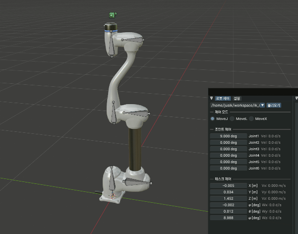 | 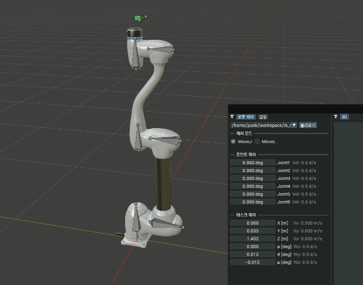 |

</details>


<details>
<summary>movel</summary>

> - 로봇 TCP가 입력된 목표 위치로 최단 거리 직선으로 이동합니다.
> - 동작 속도는 `joint velocity limit`과 `tcp max speed`값에 의해서 결정됩니다.

> ##### 💬 **Note**
> **이 함수는 일정한 주기로 호출되는 루프에서 사용하세요.** 호출 주기가 일정하지 않거나 느릴 경우 Solver 계산이 불안정해집니다. 별도의 쓰레드(타이머)에서 호출하는 것을 권장합니다.

> ##### 🚨 **Caution**
> **MoveL 함수는 특이점(Singularity)에서 불안정할 수 있습니다.** 갑자기 역관절 자세가 나오기도 하며 특정 조인트의 속도가 무한대로 발산할 수 있습니다. `Joint Limit`과
`Joint Velocity Limit`을 안전 범위 내에서만 움직이도록 설정하세요.

> ##### 💡 **Tip**
> - [`Transform::make_tf`](include/transform.hpp#L147)를 이용하면 x, y, z, roll, pitch, yaw를 이용해 Transform 매트릭스를 만들 수 있습니다.
> -  TCP를 등속도로 움직이게 하려면 `tcp_max_speed`를 낮추세요.


- 인수
  - **Transform** tf: 목표 위치 Transform 매트릭스

- 리턴
  - 없음

```c++
{
    double x, y, z, roll, pitch, yaw;
    x     = 0.3;        // [m]
    y     = 0.04;       // [m]
    z     = 0.5         // [m]
    roll  = 0;          // [rad]
    pitch = 3.14159;    // [rad]
    yaw   = 0.785398;   // [rad]
    
    // tf 계산
    Transform target = Trasform::make_tf(x, y, z, roll, pitch, yaw);
    
    // 비동기 쓰레드
    std::thread control_thread([&]() {
        while (true) {
            solver.movel(target); // target를 향해 한 스텝 계산
            SLEEP(1); // 1ms
        }
    });
    
    
    // 현재 joint 값
    vec<6> q = solver.get_curr_joint_rad();
    
    // 현재 tcp trasnform
    Transform tcp_tf = solver.get_tcp_tf();
}
```
</details>


<details>
<summary>movex</summary>

> - 로봇 TCP가 입력된 목표 위치로 이동합니다. MoveL처럼 최단 거리 직선 경로를 생성하지 않습니다.
> - 각 관절의 각속도와 동작 범위는 `Joint Limit`과 `Joint Velocity Limit`에 의해서 결정됩니다.
> - 특정 자세에서는 movel보다 빠를 수 있습니다.
> - 목표 위치로 이동중에는 싱귤러 모션이 발생하지 않습니다.

> ##### 💬 **Note**
> **이 함수는 일정한 주기로 호출되는 루프에서 사용하세요.** 호출 주기가 일정하지 않거나 느릴 경우 Solver 계산이 불안정해집니다. 별도의 쓰레드(타이머)에서 호출하는 것을 권장합니다.

> ##### ⚠️ **Warning**
> **MoveJ 함수는 `Workspace Limit`이 적용되지 않습니다.** Workspace를 넘어  TCP가 충돌 할 수 있으니 주의해서 사용하세요.

- 인수
  - Transform tf: 목표 위치 Transform 매트릭스
- 리턴
  - 없음

| movel                                           | movex                                           |
|-------------------------------------------------|-------------------------------------------------|
|  | 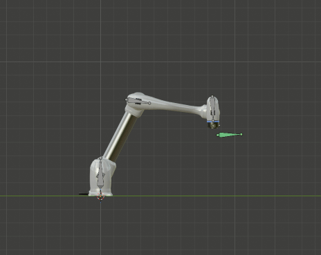 |
```c++
{
    double x, y, z, roll, pitch, yaw;
    x     = 0.3;        // [m]
    y     = 0.04;       // [m]
    z     = 0.5         // [m]
    roll  = 0;          // [rad]
    pitch = 3.14159;    // [rad]
    yaw   = 0.785398;   // [rad]
    
    // tf 계산
    Transform target = Trasform::make_tf(x, y, z, roll, pitch, yaw);
    
    // 비동기 쓰레드
    std::thread control_thread([&]() {
        while (true) {
            solver.movex(target); // target를 향해 한 스텝 계산
            SLEEP(1); // 1ms
        }
    });
    
    
    // 현재 joint 값
    vec<6> q = solver.get_curr_joint_rad();
    
    // 현재 tcp trasnform
    Transform tcp_tf = solver.get_tcp_tf();
}
```
</details>

<details>
<summary>set_end_effector_offset</summary>

> - Flange 좌표계를 기준으로 End-Effector를 추가합니다.
> - E.E가 설정되면 TCP가 자동으로 설정되며 모든 계산에 자동 적용됩니다.

> ##### 🚨 **Caution**
> - **실제 로봇 제어 시에는 End-Effector를 설정하지 마세요.** 변경된 값이 즉시 적용되기 때문에 로봇이 충돌할 수 있습니다. Initialize시에 한 번만 설정하세요.

> ##### 💡 **Tip**
> - 설정을 해제 하려면 Transform()을 사용해 초기화합니다.

```c++
{
    // end effector 설정
    vec3 pos = vec3(0.0, 0.0, 0.12);                  // pos: flange 기준 +z 축으로 0.12m
    AngleAxis rot = AngleAxis(0.0, vec3(0.0, 0.0, 1.0));  // angle axis z축, 0도

    Transform offset = Transform(rot, pos); // tf 생성
    solver.set_end_effector_offset(offset); // 적용
    
    // end effector 초기화
    Transform tf = Transform() // 단위 행렬
    solver.set_end_effector_tf(tf); // 초기화 적용
}
```


| End-Effector Setting                              |
|---------------------------------------------------|
| 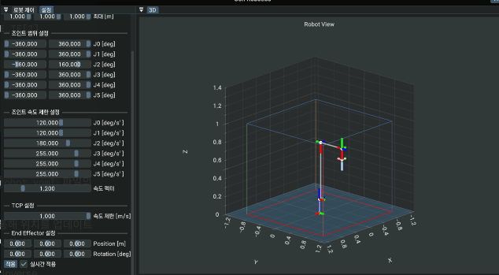 |
</details>

<details>
<summary>set_joint</summary>

> - 각 Joint의 위치를 설정합니다.
> - 함수 호출 즉시 자세가 적용됩니다.

- 인수
  - vec<6> joint: 관절 각도 벡터 [rad]
- 리턴
  - 없음

```c++
{
    vec<6> joint = {0, 0, 0, 0, 0, 0};;
    solver.set_joint(joint);
}
```

</details>

<details>
<summary>set_joint_limit</summary>

> - 각 Joint의 동작 가능한 각도 범위를 설정합니다. [rad]
> - `init`함수에서 URDF 기준으로 먼저 설정됩니다.

- 인수
  - **int** index: 관절 인덱스
  - **double** min: 최소 값 [rad]
  - **double** max: 최대 값 [rad]
- 리턴
  - 없음

| Joint3 (-160deg ~ 160deg)                       | Joint3 (1deg ~ 160deg)                          |
|-------------------------------------------------|-------------------------------------------------|
|  | 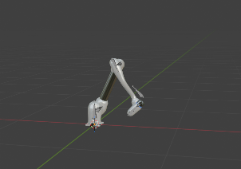 |

```c++
{
    solver.set_joint_limit(0, DEG_TO_RAD(-360.0), DEG_TO_RAD(360.0)); // joint 0
    solver.set_joint_limit(1, DEG_TO_RAD(-360.0), DEG_TO_RAD(360.0)); // joint 1
    solver.set_joint_limit(2, DEG_TO_RAD(-160.0), DEG_TO_RAD(160.0)); // joint 2
    solver.set_joint_limit(3, DEG_TO_RAD(-300.0), DEG_TO_RAD(360.0)); // joint 3
    solver.set_joint_limit(4, DEG_TO_RAD(-300.0), DEG_TO_RAD(360.0)); // joint 4
    solver.set_joint_limit(5, DEG_TO_RAD(-300.0), DEG_TO_RAD(360.0)); // joint 5
}
```
</details>


<details>
<summary>set_joint_velocity_limit</summary>

> - 각 Joint의 최대 각속도를 설정합니다. [rad/s]
> - `init`함수에서 URDF 기준으로 먼저 설정됩니다.

> ##### 💬 **Note**
> - 최대 각속도 값이 클 경우 로봇 하드웨어에서 멈추는 현상이 발생할 수 있습니다. 실제 로봇 스펙에 맞게 설정하세요.

- 인수
  - **int** index: 관절 인덱스
  - **double** vlimit: 최대 값 [rad/s]
- 리턴
  - 없음

| Limit                                             | No Limit                                          |
|---------------------------------------------------|---------------------------------------------------|
| 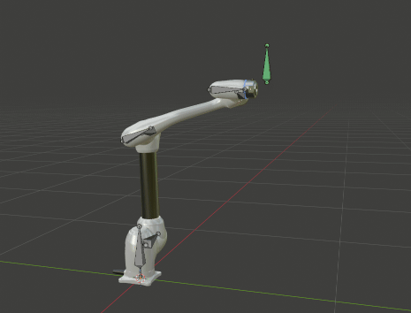 | 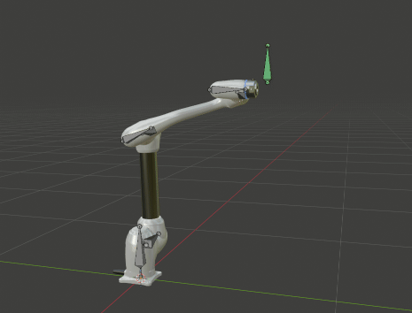 |

```c++
    solver.set_joint_velocity_limit(0, DEG_TO_RAD(120.0)); // joint 0
    solver.set_joint_velocity_limit(1, DEG_TO_RAD(120.0)); // joint 1
    solver.set_joint_velocity_limit(2, DEG_TO_RAD(180.0)); // joint 2
    solver.set_joint_velocity_limit(3, DEG_TO_RAD(255.0)); // joint 3
    solver.set_joint_velocity_limit(4, DEG_TO_RAD(255.0)); // joint 4
    solver.set_joint_velocity_limit(5, DEG_TO_RAD(255.0)); // joint 5
```
</details>

<details>
<summary>set_joint_velocity_limit_scale</summary>

> - 설정된 `Joint Velocity Limit`의 최대 각속도 비율을 조절 합니다.
> - URDF로 설정되는 값이 아니므로 코드에서 별도로 설정해야 합니다. 기본 값은 0.8 입니다.

- 인수
  - **double** scale: 마진률 [ 0.0 ~ 1.0]
- 리턴
  - 없음

```c++
{
    solver.set_joint_velocity_limit_scale(0.8); // 최대 속도의 80%만 사용
}
```
</details>

<details>
<summary>set_workspace_limit</summary>

> - TCP의 Workspace 범위를 설정합니다. E.E가 설정된 경우 자동으로 TCP가 E.E로 계산됩니다.
> - URDF로 설정되는 값이 아니므로 코드에서 별도로 설정해야 합니다. 기본 값은 예시 코드와 같습니다.

> ##### ⚠️ **Warning**
> - MoveL 함수만이 `Workspace Limit`가 적용됩니다. **MoveJ와 MoveX를 사용할 경우 `Workspace Limit`가 적용되지 않습니다.**

- 인수
  - **double** min: 최대 값 [m]
  - **double** max: 최소 값 [m]
- 리턴
  - 없음

| Workspace Limit                                 | Move to Limit                                   |
| ----------------------------------------------- | ----------------------------------------------- |
| 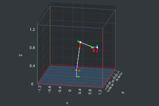 | 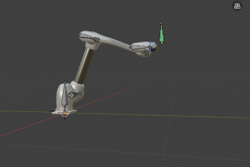 |

```c++
{
    solver.set_workspace_limitX(-1.3, 1.3); // X min, max [m]
    solver.set_workspace_limitY(-1.3, 1.3); // Y min, max [m]
    solver.set_workspace_limitZ(0.0, 1.3);  // Z min, max [m]
}
```
</details>


<details>
<summary>set_tcp_max_speed</summary>

> - TCP의 최대 이동 속도를 설정합니다. [m/s]
> - URDF로 설정되는 값이 아니므로 코드에서 별도로 설정해야 합니다. 기본 값은 1.0 입니다.

- 인수
  - **double** speed: 최대 이동 속도 [m/s]
- 리턴
  - 없음

| speed = 1.0                                       | speed = 0.1                                       |
|---------------------------------------------------|---------------------------------------------------|
|  | 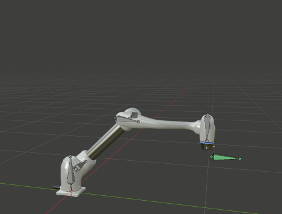 |

```c++
{
    solver.set_tcp_speed_limit(1.0); // [m/s]
}
```
</details>


<details>
<summary>get_curr_joint</summary>

> 현재 Joint 각도를 리턴합니다. [deg, rad]

- 인수
  - 없음
- 리턴
  - **vec<6>**: 현재 Joint 각도 [deg, rad]

```c++
{
    // rad
    vec<6> q_rad = solver.get_curr_joint_rad();
    
    // deg
    vec<6> q_deg = solver.get_curr_joint_deg();
}
```

</details>


<details>
<summary>get_curr_joint_velocity</summary>

> 현재 Joint의 각속도를 리턴합니다. [deg/s, rad/s]

- 인수
  - 없음
- 리턴
  - **vec<6>**: 현재 Joint의 각속도 [deg/s, rad/s]

```c++
{
    // rad/s
    vec<6> jvel_rad = solver.get_curr_joint_velocity_rad();
    
    // deg/s
    vec<6> jvel_deg = solver.get_curr_joint_velocity_deg();
}
```

</details>


<details>
<summary>get_curr_tcp_speed</summary>

> 현재 tcp의 속도를 리턴합니다.  [m/s] [x, y, z, roll, pitch, yaw]

- 인수
  - 없음
- 리턴
  - **vec<6>**: tcp의 속도, 각속도 [m/s, rad/s]

```c++
{
    vec<6> tcp_speed = solver.get_curr_tcp_speed(); 
}
```
</details>


<details>
<summary>get_end_effector_offset</summary>

> 현재 TCP의 위치를 4x4 매트릭스로 리턴합니다.

- 인수
  - 없음
- 리턴
  - **Transform**: tcp의 위치와 방향을 나타내는 4x4 행렬

```c++
{
    Transform tcp_tf = solver.get_end_effector_offset();
}
```
</details>


<details>
<summary>get_joint_info</summary>

> 각 Joint의 정보를 담은 Kinematics 구조체를 리턴합니다.

- 인수
  - **int** index: 해당하는 조인트의 인덱스
- 리턴
  - **JointInfo**: 해당하는 조인트의 정보를 담은 구조체

```c++
{
    JointInfo info = solver.get_joint_info(0);
}
```
</details>


<br>

## Singular Motion

> [!NOTe]
> Singular Motion에서 특정 관절의 속도가 발산되지 않으면서 TCP의 에러를 최소화 하는 Joint를 계산합니다.

| Elbow                                           | Ebow                                            | Elbow                                           |
| ----------------------------------------------- | ----------------------------------------------- | ----------------------------------------------- |
| 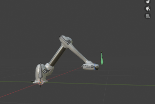 | 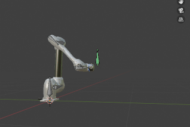 | 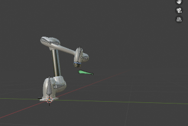 |


| Shoulder                                          | Shoulder                                          | Elbow                                             |
| ------------------------------------------------- | ------------------------------------------------- | ------------------------------------------------- |
| 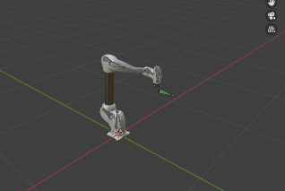 | 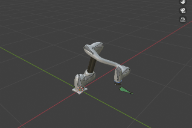 | 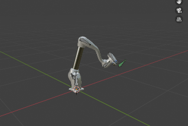 |

<br>

## 갑작스런 target_tf의 변화 대응

> [!NOTE]
> target_tf가 갑작스럽게 변화할 경우, 최대 속도 제한을 적용하여 안정적인 동작이 가능합니다.

| 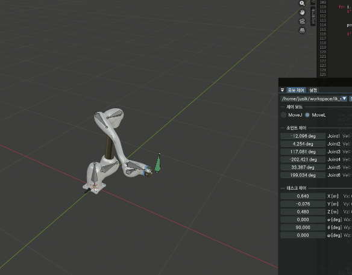 | 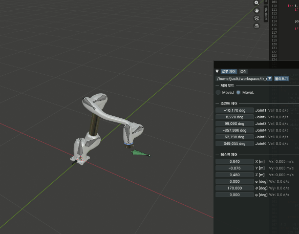  |
|:-------------------------------------------------:|:--------------------------------------------------:|
|      target까지 변화량이 큰 경우 동작할 수 있는 최대 속도로 움직임       |           싱귤러 모션을 통과하는 경우에도 속도 안정성을 유지함            |

<br>

## 유틸리티

> [!NOTE]
> 일부 유틸리티는 사용이 안될 수 있습니다.

| URDF 편집기 | https://urdfgen-ma7gxyh7.manus.space/ |
|----------|---------------------------------------|

<br>

## 예제 코드

```c++
#include iostream
#include "ik_solver.h"

int main() 
{
    // ---------------------------------------------
    // 솔버 생성 및 기본 설정
    // ---------------------------------------------
    IkSolver solver = IkSolver(urdf_file);
  
    if (!solver.init())
        return -1;
  
    // Joint Limit
    solver.set_joint_limit(0, RAD(-360), RAD(360));  // J1 [rad]
    solver.set_joint_limit(1, RAD(-360), RAD(360));  // J2 [rad]
    solver.set_joint_limit(2, RAD(-360), RAD(360));  // J3 [rad]
    solver.set_joint_limit(3, RAD(-360), RAD(360));  // J4 [rad]
    solver.set_joint_limit(4, RAD(-360), RAD(360));  // J5 [rad]
    solver.set_joint_limit(5, RAD(-360), RAD(360));  // J6 [rad]

    // Joint Velocity Limit
    solver.set_joint_velocity_limit(0, RAD(360));   // J1 [rad/s^2]
    solver.set_joint_velocity_limit(1, RAD(360));   // J2 [rad/s^2]
    solver.set_joint_velocity_limit(2, RAD(360));   // J3 [rad/s^2]
    solver.set_joint_velocity_limit(3, RAD(360));   // J4 [rad/s^2]
    solver.set_joint_velocity_limit(4, RAD(360));   // J5 [rad/s^2]
    solver.set_joint_velocity_limit(5, RAD(360));   // J6 [rad/s^2]
  
    // Workspace Limit
    solver.set_workspace_limitX(-1.0, 1.0); // -x, x [m]
    solver.set_workspace_limitY(-1.0, 1.0); // -y, y [m]
    solver.set_workspace_limitZ( 0.0, 1.0); // -z, z [m]

    // TCP Speed Limit
    solver.set_tcp_speed_limit(1.0);             // tcp max speed [m/s]
    solver.set_joint_velocity_limit_scale(0.8);  // [0.0 ~ 1.0] 
  
  
    // ---------------------------------------------
    // 제어
    // ---------------------------------------------
    while (true) {
  
        // Case movej
        double q[6] = {q0, q1, q2, q3, q4, q5}; // [rad]
        solver->movej(q);
  
        // Case moveL
        Transform tf = Transform::make_tf(x, y, z, a, b, c); // x, y, z, yaw, pitch, roll [m, rad]
        solver.movel(tf);
  
        vec<6> calculated_joint = solver.get_curr_joint_rad(); // ★ 계산된 조인트 값 [rad]
  
        SLEEP(1); // [ms]
    }
  
    return 0;
}
```
